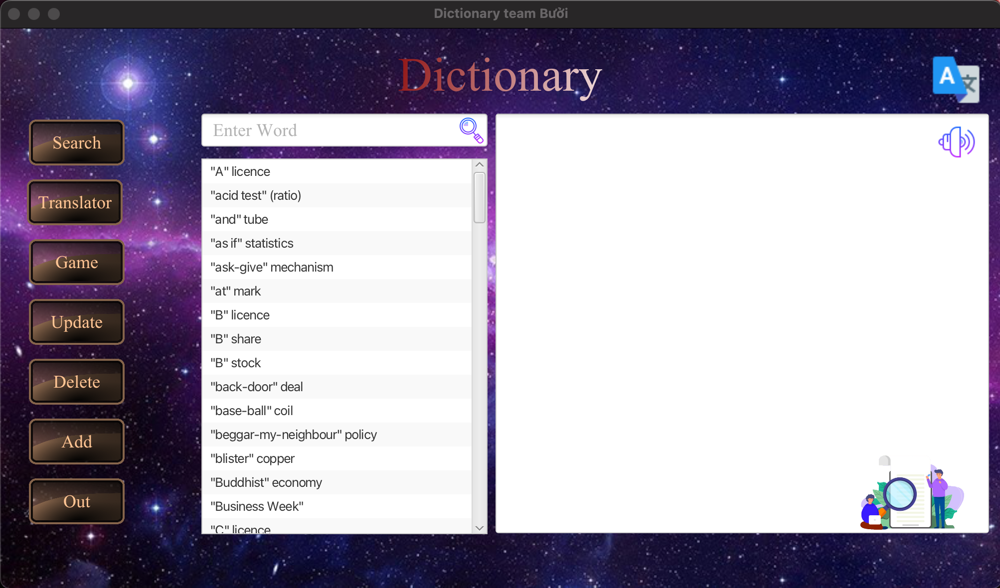

# Dictionary Application

## Contributors
22028216 Nguyễn Việt Bách

22028200 Nguyễn Quang Cảnh

## Introduction
Bài tập lớn số 1 - Từ điển (UET OASIS - I2324 INT2204 22 - Lập trình hướng đối tượng)

## Features

* Thêm, sửa, xóa từ

* Tra từ

* Phát âm tiếng anh

* API google translate Anh <> Việt

* Game học tiếng anh 

  ...

## Technologies 

IntelliJ IDEA Community Edition 2021.2.1

Scene Builder 2.0

Java SE Development Kit 21

JavaFX vesion 21.0.1

Maven Framework

## Guide

Run -> Edit Configurations... -> Add new run configuration... -> Application

* Main class: DictionaryApplication.App
* Name: App

Modify options -> Add VM options

* VM options: --module-path "\path\to\javafx-sdk-17.0.1\lib" --add-modules javafx.controls,javafx.fxml

## Preview 

